# DEVNS

[](https://github.com/kpcure/DEVNS/actions/workflows/ci.yml)
[](LICENSE)
[](https://www.typescriptlang.org/)

[中文说明](README.zh-CN.md) | [Roadmap](ROADMAP.md) | [Contributing](CONTRIBUTING.md) | [Security](SECURITY.md)

DEVNS is a local-first control plane that keeps long-running coding agents tied to approved intent, explicit evidence, and reviewable feature-sized commits.

Coding agents can write code quickly. DEVNS focuses on the part that usually breaks next: keeping long-running agent work grounded, reviewable, and recoverable.

## Why DEVNS

Without a harness, an overnight agent run can leave you with a pile of commits and no reliable answer to four questions:

- What was the approved intent?
- Which acceptance criteria were actually verified?
- What changed in product code versus agent state?
- What should a human review first?

DEVNS turns that into a local workflow:

- JSON is the fast, agent-readable source of truth.
- Markdown records the project knowledge that should survive across sessions.
- HTML becomes the human review and control surface.
- Every agent run claims one feature, implements it, verifies it, commits it, records evidence, and loops.
- The next morning review is not a raw commit list. It is a structured mission report grouped by milestone, risk, behavior, evidence, and diff.
- The core is generic, but the edges are designed for second development: skills, hooks, review agents, test agents, sensors, and UI panels can be replaced by each project.

## Quick Start

Install from npm with the scoped package name. The unscoped `devns` name on npm belongs to another project.

```sh
npx @kpcure/devns doctor
npx @kpcure/devns init --project-name "Example Project" --project-description "Describe the migration or feature goal."
npx @kpcure/devns discover --json
npx @kpcure/devns orchestrate --host codex --json
npx @kpcure/devns stop-log --tail 20
npx @kpcure/devns dashboard
```

When developing this repository locally:

```sh
npm install
npm run devns -- doctor
npm run devns -- dashboard
```



```mermaid
flowchart LR
  A["Project goal"] --> B["Discovery candidates"]
  B --> C["RFC clarification"]
  C --> D["Approved feature"]
  D --> E["Main orchestrator"]
  E --> F["Implementation subagent"]
  F --> G["Lanes and evidence"]
  G --> H["Review subagent"]
  H --> I["Feature commit"]
  I --> J["Morning review"]
```

This project is inspired by the May 20, 2026 Claude blog article, [Using Claude Code: The unreasonable effectiveness of HTML](https://claude.com/blog/using-claude-code-the-unreasonable-effectiveness-of-html), which argues that HTML is unusually effective as a human-in-the-loop interface for agent work because it is easier to inspect, navigate, and interact with than plain Markdown for many review tasks.

## Problem

Modern coding agents are fast enough that the bottleneck is no longer only implementation speed. With multiple agents, sessions, or overnight loops, the human reviewer can quickly become the constraint.

Reviewing ten independent feature commits in the morning is workable, but inefficient:

- The reviewer must reconstruct intent from commit messages and diffs.
- Feature behavior, tests, risks, and acceptance criteria are scattered.
- Milestone progress is hard to scan.
- Regressions are easier to miss because commits are reviewed as isolated Git artifacts rather than as a product migration story.

DEVNS treats review as a first-class product surface.

## Philosophy

Generic workflows are rarely adopted unchanged by serious engineering teams. Each repository already has its own tests, risk model, release rules, domain language, and review habits.

DEVNS therefore provides a stable harness core with editable edges. Use the defaults to start, then replace the parts that do not fit your project.

## First Run Details

After installing DEVNS in a target project, start with the doctor:

```sh
npx @kpcure/devns doctor
```

When developing this repository locally, the same entrypoint is available through npm:

```sh
npm run devns -- doctor
```

The doctor reports the current DEVNS mode and the next action. It tells you whether to initialize the workspace, continue an active feature, claim the next approved feature, clarify an RFC, or stop because the queue is empty.

For a new project, initialize the DEVNS workspace first:

```sh
npx @kpcure/devns init --project-name "Example Project" --project-description "Describe the migration or feature goal."
```

Then use the `devns-init` skill to discover candidate features. Candidates are not executable work yet. A candidate must go through the `devns-rfc` skill and receive human approval before it can become a ready feature.

For an existing DEVNS workspace, ask the agent to use the `devns-run` skill or run Orchestrator Mode:

```sh
npx @kpcure/devns orchestrate --host codex --json
```

Humans can open the dashboard with:

```sh
npx @kpcure/devns dashboard
```

## Local Runtime, Not A CLI-First Product

DEVNS exposes one user-facing command, `devns`, but the CLI is not the primary product experience.

The command is the local runtime surface used by hooks, skills, plugins, the dashboard, local automation, and CI. It gives those integrations one stable way to call the harness core instead of depending on internal TypeScript files or reimplementing behavior per host.

This matters because Claude Code, Codex, Cursor, and future hosts expose different plugin and hook models. The command surface is the shared base where DEVNS can control default prompts, skills, hooks, lanes, policies, state transitions, and evidence writing while still letting projects override those pieces through configuration. Internal `devns:*` and `harness:*` scripts are development and adapter details; general users should start from `npx @kpcure/devns ...` or the host skill.

Humans should usually interact with the HTML dashboard and reports. Agents should usually interact through `AGENTS.md`, skills, hooks, and structured JSON. The command surface is the portable substrate underneath those interfaces.

## Workflow

1. A human starts with `npm run devns -- doctor`, the dashboard, or a DEVNS skill.
2. Discovery writes candidate features into JSON.
3. The RFC skill clarifies requirements, validation, and unknowns before work becomes ready.
4. The main agent runs `devns orchestrate`, claims one approved feature, and stays as queue/evidence orchestrator.
5. The main agent delegates implementation to one feature subagent, then runs deterministic lanes.
6. The main agent delegates read-only review to a review subagent or configured review lane.
7. `devns complete` records implementation commit metadata and durable history for that feature, then the main agent creates exactly one feature commit.
8. Stop hooks remain installed as safety nets for unsafe shutdown, not as the primary work loop.
9. The dashboard and reports render human-facing review by feature, risk, evidence, and diff.

## Repository Shape

- `AGENTS.md`: operating protocol for coding agents.
- `docs/repository-structure.md`: open-source file layout and ignored local workbench policy.
- `docs/getting-started.md`: first-run setup.
- `docs/command-surface.md`: local runtime command surface rationale.
- `docs/orchestrator-mode.md`: main-agent plus subagent execution model.
- `docs/configuration.md`: DEVNS config reference.
- `docs/devns-workspace.md`: `.devns/` workspace contract.
- `docs/feature-schema.md`: feature inventory format.
- `docs/claude-code-hooks.md`: actual Claude Code hook model and Stop hook integration.
- `docs/codex-plugin.md`: Codex plugin package notes.
- `docs/plugin-packaging.md`: plugin package layout.
- `examples/mission-migration-dashboard/features.json`: sample task inventory.
- `templates/devns/devns.config.json`: starter harness configuration.
- `templates/claude-code/.claude/settings.json`: Claude Code hook configuration template.
- `plugins/claude-code/devns/`: Claude Code plugin package.
- `plugins/codex/devns/`: Codex plugin package.
- `tools/schema/features.schema.json`: JSON schema for feature inventory.
- `hooks/stop-hook.md`: Stop hook design reference.
- `packages/core/src/harness/`: actual harness core code.
- `packages/core/src/cli/claude-stop-hook.ts`: Claude Code Stop hook runner.
- `apps/dashboard/`: local HTML review plane.
- `.workbench/`: ignored local state and intermediate artifacts for developing this repository.

## License

DEVNS is licensed under the Apache License, Version 2.0. See `LICENSE` and `NOTICE`.

## Current Status

DEVNS is at the 1.0 hardening stage. The core workflow is implemented: doctor/init/discover/RFC/run/lanes/evidence/review/complete/stop, plugin packages, JSON schemas, a local dashboard, review packets, evidence quality gates, and smoke coverage.

The stable surface is the local `devns` entrypoint, `.devns/` workspace contract, feature/RFC/evidence schemas, command lanes, review packets, and completion metadata. Areas still evolving are richer browser lanes, project-specific policy packs, long-context budgeting, and broader golden/eval coverage. See `ROADMAP.md` and `docs/1.0-hardening-roadmap.zh-CN.md`.

## Local Development

Initialize a local DEVNS workspace:

```sh
npm install
npx @kpcure/devns doctor
npm run devns -- doctor
npm run devns -- init --project-name "Example Project" --project-description "Describe the migration or feature goal."
npm run devns -- doctor
```

Run the development dashboard:

```sh
npm run devns -- dashboard
```

Then open `http://127.0.0.1:5173/`.

Build verification:

```sh
npm run build
```

Claude Code Stop hook setup uses a native `type: "agent"` Stop hook prompt:

```sh
cp -R templates/claude-code/.claude .claude
npm run devns -- validate
```
